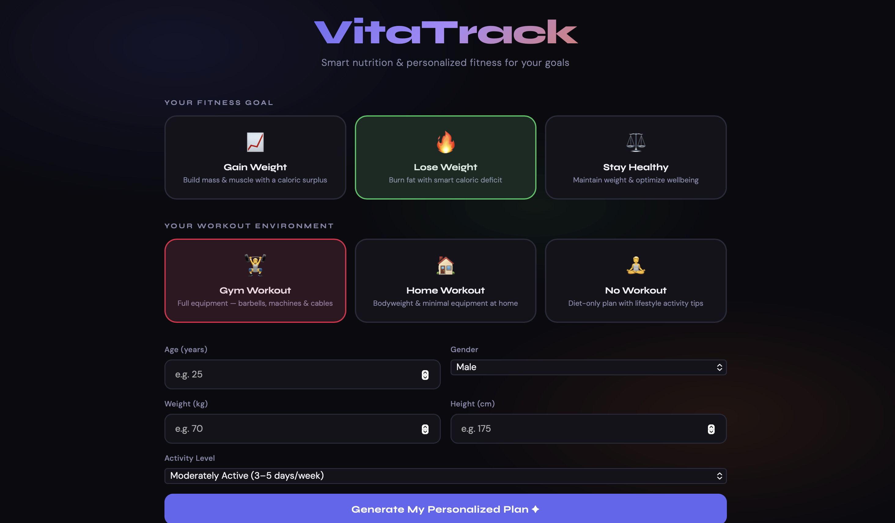
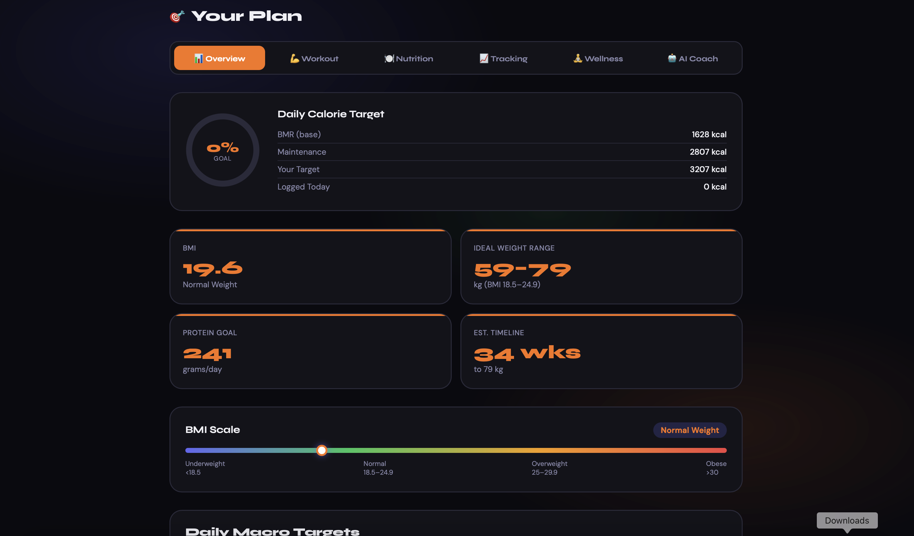
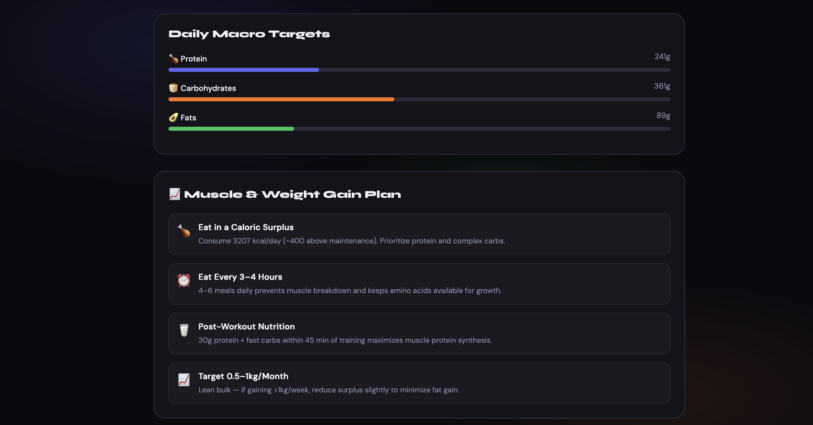
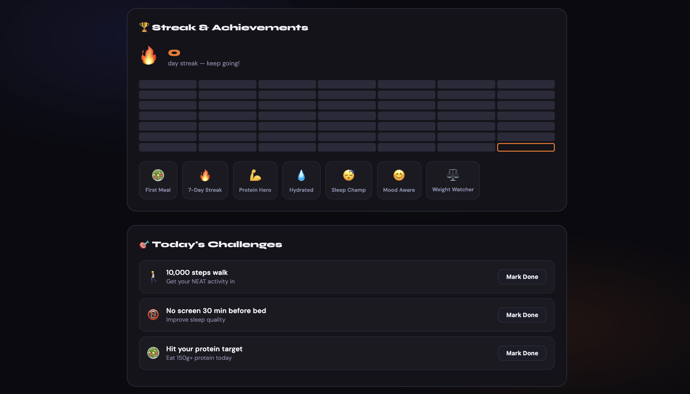
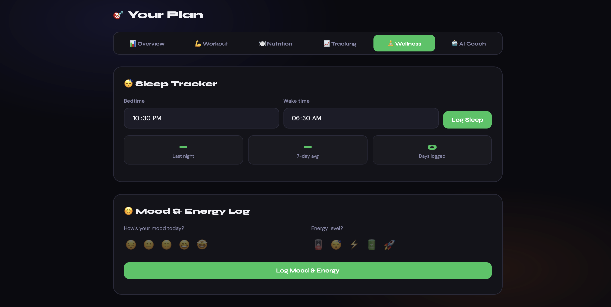

<div align="center">



# VitaTrack

**Smart Nutrition & Personalized Fitness Tracker**

[](./LICENSE)
[](https://nodejs.org)
[](https://react.dev)
[](https://www.typescriptlang.org)
[](https://www.postgresql.org)
[](https://anthropic.com)
[](https://pnpm.io)
[](https://vitejs.dev)
[](https://expressjs.com)
[](https://www.openapis.org)

[**🚀 Live Demo**](https://ayuuXploits.github.io/VITATRACK/) &nbsp;·&nbsp; [**🐛 Report Bug**](https://github.com/ayuuXploits/VITATRACK/issues/new?assignees=&labels=bug&template=bug_report.md&title=%5BBug%5D+) [**✨ Request Feature**](https://github.com/ayuuXploits/VITATRACK/issues/new?assignees=&labels=enhancement&template=feature_request.md&title=%5BFeature%5D+)

<br/>

*A full-stack health platform that calculates your personalized calorie & macro targets, plans your weekly workouts, and coaches you with AI — all in one place.*

<br/>

 &nbsp; 
 &nbsp; 

</div>

---

## ✨ Features

### 🧮 Personalized Targets
- Calorie & macro goals calculated from age, weight, height, and activity level via the **Mifflin-St Jeor** formula
- Override targets with custom, doctor-prescribed values
- 6 fitness goal modes: **Lose Weight**, **Gain Weight**, **Stay Healthy** — each with gym, home, and no-workout variants

### 🏋️ Workouts
- **7-day weekly routines** tailored to your goal and environment
- **Guided Workout Mode** — step-through exercise coach with a built-in rest timer
- **40+ exercise library** spanning chest, back, legs, shoulders, arms, and core

### 🥗 Nutrition
- **Smart Calorie Log** with a searchable database of 50+ Indian & international foods
- **Meal Templates** — save and reload favourite meals in one click
- Export food logs as **CSV** or **PDF**

### 📊 Progress Tracking
- **Weight Trend Chart** with 7-day moving average
- **Body Measurement Tracker** — chest, waist, hips, and arms over time
- **Sleep Tracker** — log bedtime & wake time with weekly averages
- **Mood & Energy Log** — track wellbeing alongside fitness data
- **Hydration Tracker** — glass-by-glass water logging with a daily goal

### 🏆 Engagement
- **49-day Activity Heatmap** and **7 achievement badges**
- **3 randomized daily challenges** to keep you on your toes
- Streak tracking to build long-term habits

### 🤖 AI Health Coach
Powered by **Claude (Anthropic)** via Replit AI Integrations. Provides:
- Personalized meal suggestions
- Workout tips and form guidance
- Weekly progress summaries
- Motivational nudges

---

## 🛠️ Tech Stack

| Layer | Technology |
|-----------|--------------|
| **Frontend** | React 19, Vite 6, TypeScript 5.9 |
| **Styling** | Custom CSS (dark theme) + Tailwind CSS v4 |
| **Charts** | Recharts + Chart.js |
| **Backend** | Node.js 24, Express 5 |
| **AI** | Anthropic Claude (via Replit AI Integrations) |
| **Validation** | Zod v4, Drizzle-Zod |
| **API Contract** | OpenAPI 3.1 + Orval codegen |
| **Database** | PostgreSQL + Drizzle ORM |
| **Package Manager** | pnpm workspaces |
| **Build**   | esbuild (server), Vite (client) |
| **Logging** | pino (structured JSON) |

---

## 🗂️ Project Structure

```
vitatrack/
├── index.html                  # Main HTML entry point
├── frontend/
│   ├── css/style.css           # All styles (dark theme)
│   └── js/
│       ├── app.js              # Main application logic
│       ├── data.js             # Data management
│       ├── ui.js               # UI rendering functions
│       └── utils.js            # Utility functions
├── backend/
│   ├── server.js               # Express server
│   ├── routes/                 # API route definitions
│   ├── controllers/            # Route handlers
│   └── middleware/             # Auth, logging, error handling
├── data/
│   ├── exercises.js            # Exercise database (40+ entries)
│   ├── foods.js                # Food database (50+ entries)
│   └── routines.js             # Weekly workout routines
└── docs/
    └── *.png                   # Screenshots & assets

```

---

## 🚀 Getting Started

### Prerequisites

| Tool | Version |
|---|---|
| Node.js | `>=24.0.0` |
| pnpm | `>=9.0.0` |

### 1. Clone the repository

```bash
git clone https://github.com/ayuuXploits/VITATRACK.git
cd vitatrack
```

### 2. Install dependencies

```bash
cd backend
npm install
```

### 3. Configure environment variables

```bash
cp .env.example .env
# Edit .env and fill in your values (see below)
```

### 4. Start development servers

> ⚠️ **Never run `pnpm dev` at the workspace root.** Each package has its own dev script.

```bash
# Start the API server
pnpm --filter @workspace/api-server run dev

# In a separate terminal, start the frontend
pnpm --filter @workspace/vitatrack run dev
```

### 5. Build for production

```bash
pnpm run build
```

### 6. Regenerate API types (after OpenAPI spec changes)

```bash
pnpm --filter @workspace/api-spec run codegen

```

> Run `pnpm run typecheck` for a full type check across all packages.

---

## 🔐 Environment Variables

Create a `.env` file in the `backend/` directory:

```env
PORT=3000
CLAUDE_API_KEY=your_claude_api_key_here
NODE_ENV=development
```

---

## 📡 API Reference

### Health Check

```http
GET /api/healthz
```

Returns `200 OK` when the server is healthy.

---

### Calculate BMR, TDEE & Macros

```http
POST /api/calculate
```

**Body**

```json
{
  "age": 25,
  "weight": 75,
  "height": 175,
  "gender": "male",
  "activityLevel": "moderate",
  "goal": "lose_weight"
}
```

---

### AI Health Coach

```http
POST /api/vitatrack/ai-coach
```

**Request**

```json
{
  "prompt": "Suggest 3 meal ideas for 400 remaining calories"
}
```

**Response**

```json
{
  "text": "Here are 3 great meal ideas..."
}
```

---

### Food & Progress Logging

```http
POST /api/log/food      # Log a food entry
POST /api/log/weight    # Log a weight entry
POST /api/log/sleep     # Log a sleep entry
```

---

## 🧑‍💻 Development Notes

- **Structured logging**: Use `req.log` inside route handlers — the server uses `pino` for JSON-formatted logs.
- **Type safety**: API types are generated via Orval from the OpenAPI 3.1 spec. Always run codegen after spec changes.
- **Monorepo**: The project uses `pnpm workspaces`. Each package (`api-server`, `vitatrack`, `api-spec`) is independent.

---

## 📄 License

**Copyright © 2026 ayuuXploits. All rights reserved.**

This software and its associated documentation are proprietary to Ayush Kumar. No part of this software may be copied, modified, merged, published, distributed, sublicensed, or sold without the express written permission of the owner.

---

<div align="center">

Built with ❤️ by [ayuuXploits](https://github.com/ayuuXploits)

</div>
